# Ejercicio 1: Máquina de Estados Finitos combinada para control de pulsador y LED

## Objetivo

Diseñar una máquina de estados finitos (MEF) que primero controle el rebote del pulsador (usando antirrebotes), y luego utilice su salida estable para alternar el encendido y apagado de un LED.

---

## Diagrama de Estados Combinado

## Tabla de transiciones
### Antirrebote

| Estado Actual     | Evento / Condición   | Estado Siguiente  |
| ----------------- | -------------------- | ----------------- |
| Espera            | Pulsador ON          | Debounce\_Press   |
| Debounce\_Press   | 30 ms y Pulsador ON  | Presionado        |
| Debounce\_Press   | 30 ms y Pulsador OFF | Espera            |
| Presionado        | 30 ms y Pulsador OFF | Debounce\_Release |
| Presionado        | 30 ms y Pulsador ON  | Presionado        |
| Debounce\_Release | 30 ms y Pulsador OFF | Espera            |
| Debounce\_Release | 30 ms y Pulsador ON  | Presionado        |

### LED

| Estado Actual | Evento           | Estado Siguiente |
| ------------- | ---------------- | ---------------- |
| LED\_Off      | Pulsador estable | LED\_On          |
| LED\_On       | Pulsador estable | LED\_Off         |

# Ejercicio 2: Problema

Un tanque de agua abierto por la parte superior dispone de tres sensores de detección de llenado (A, B, C) que determinan 4 posibles niveles de llenado (VACÍO, NORMAL, LLENO, ALARMA). El  nivel del tanque se controla mediante dos válvulas (E, entrada y S, salida).
En condiciones de llenado normal, las válvulas E y S se encuentran abiertas.
Si el líquido llega al nivel de vacío, se  cierra la válvula de salida y se mantiene abierta la de entrada. Si el líquido llega al nivel de lleno, se cierra la válvula de entrada y se mantiene abierta la de salida. Si por cualquier circunstancia, por ejemplo lluvia, se llegara al nivel de alarma, se deberá cerrar la válvula de entrada y abrir la de salida. Esta situación se mantendrá hasta que el tanque llegue al estado de vacío.

.png>)

## Tabla de transiciones

| Estado actual | Entradas (ABC) | Próximo estado  | E (Entrada) | S (Salida) | Observación           |
| ------------- | -------------- | --------------- | ----------- | ---------- | --------------------- |
| Vacío         | 000            | Normal          | 1           | 0          | Llenando              |
| Normal        | 001            | Lleno           | 1           | 1          | Flujo continuo        |
| Lleno         | 011            | Alarma o Normal | 0           | 1          | Vaciando              |
| Alarma        | 111            | Vacío           | 0           | 1          | Drenaje de emergencia |

## Diagrama de Estados

```mermaid
stateDiagram-v2
    [*] --> Vacío

    Vacío --> Normal: ABC = 000\nE=1, S=0
    Normal --> Lleno: ABC = 001\nE=1, S=1
    Lleno --> Alarma: ABC = 011 → 111\nE=0, S=1
    Alarma --> Vacío: ABC = 111 → 000\nE=0, S=1
    Lleno --> Normal: ABC = 011 → 001\nE=0, S=1
    Normal --> Vacío: ABC = 001 → 000\nE=1, S=0
```

# Ejercicio 3:Control de un Sistema de Riego Inteligente

## 📘 Descripción del Problema

Se debe diseñar un **sistema de riego automático** basado en la humedad del suelo y un temporizador. El sistema debe cumplir las siguientes condiciones:

- Si la humedad del suelo es baja, el riego se activa.
- Una vez activado, debe permanecer encendido por **5 minutos** o hasta que el sensor de humedad indique un nivel adecuado.
- Si llueve (detectado por un sensor de lluvia), el sistema de riego debe detenerse inmediatamente.
- Debe haber un modo manual en el cual un usuario puede **forzar el riego**.

---

## 🔁 Diagrama de Estados (FSM)

-`Espera`: Estado de reposo. Espera condiciones de riego.

-`Riego`: Activa la bomba de agua.

## Tabla de transiciones

| Estado Actual | Entrada                 | Próximo Estado | Salida (Riego) |
| ------------- | ----------------------- | -------------- | -------------- |
| Espera        | humedad\_baja ∧ ¬lluvia | Riego          | 1              |
| Espera        | modo\_manual            | Riego          | 1              |
| Riego         | humedad\_adecuada       | Espera         | 0              |
| Riego         | lluvia                  | Espera         | 0              |
| Riego         | tiempo ≥ 5 min          | Espera         | 0              |

## ¿FSM de Moore o Mealy?

Mealy

Razones:

-La salida (activar riego) **depende directamente de las entradas** (`lluvia`, `humedad`, `modo_manual`, `tiempo`).

-Esto permite **reacciones inmediatas** al cambio de condiciones sin necesidad de cambiar de estado.

-En una FSM de Moore, las salidas dependen solo del estado, lo que podría demorar la respuesta frente a eventos repentinos como la lluvia.